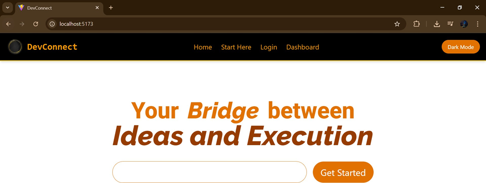
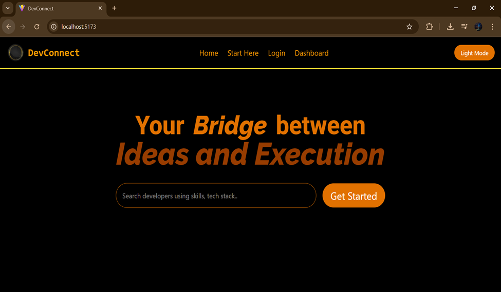
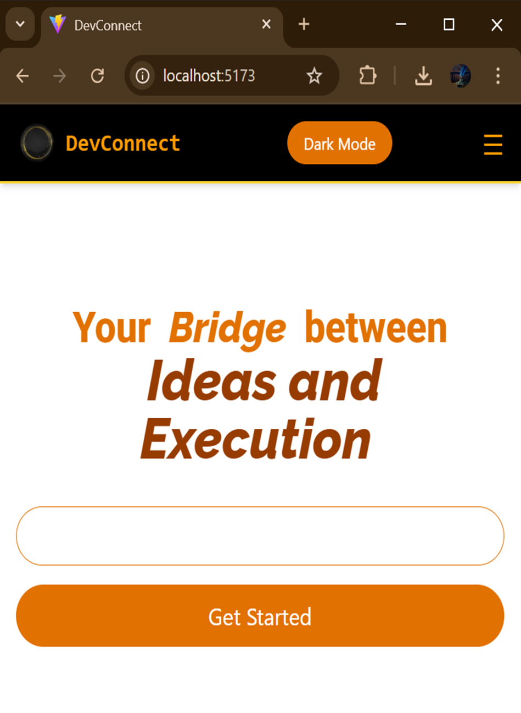

# DevConnect Web App 💼🚀

DevConnect is a responsive web application built with React and Tailwind CSS, designed to connect developers and users through a simple, clean interface. It includes role-based sign-up and login, a dashboard, and a theme toggle feature.

## 📂 Folder Structure
DevConnect/
├── public/
│ └── logo.jpg
├── src/
│ ├── App.jsx
│ ├── main.jsx
│ ├── index.css
│ ├── Navbar.jsx
│ ├── LandingPage.jsx
│ ├── SelectionPage.jsx
│ ├── LoginPage.jsx
│ ├── LoginForm.jsx
│ ├── SignupPage.jsx
│ ├── SignupForm.jsx
│ └── Dashboard.jsx

## 🔧 Tools & Technologies

- **React JS** (v18+)
- **React Router DOM**
- **Tailwind CSS** for responsive styling
- **Vite** for lightning-fast build and development
- **LocalStorage** for theme persistence

## ✨ Features

- 🌓 **Light/Dark Mode Toggle**
- 👤 Role-based login & signup (User / Developer)
- 📱 Fully **Responsive** for Mobile, Tablet & Desktop
- 🧭 Navigation with React Router
- 🗃️ Sidebar with active tabs (Profile / Projects)
- ⚙️ Clean, readable component-based code

## 📸 Screenshots

